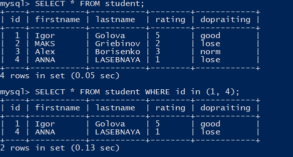
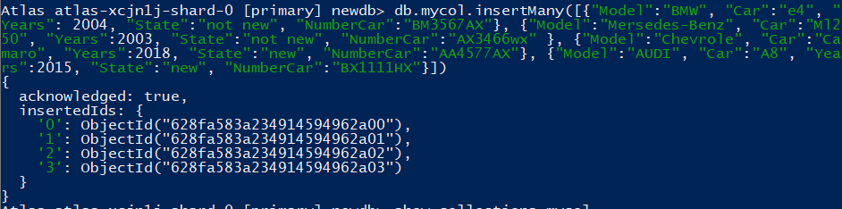

# Task 2

## Part 1 MYSQL.

### 1. Dowloaded MySQL.

> sudo wget https://dev.mysql.com/get/mysql80-community-release-el7-3.noarch.rpm

### 2. Install MySQL.

> yum install mysql-server mysql-client

### 3. DESQ DB.

> SHOW DATABASES;

> USE mysql;

> SHOW TABLES;


#### DESC TABLES:

>DESC "TABLE";


### 4-5. Create Database, Tables.

> mysqladmin -p create TESTDATABASE

> mysql> Create TABLE TEST_TABLE (
        id INT(6) UNSIGNED AUTO_INCREMENT PRIMARY KEY,
        firstname VARCHAR(30) NOT NULL,
        lastname VARCHAR(30) NOT NULL,
        email VARCHAR(30),
        reg_date TIMESTAMP
        );

OR

> mysql -p DATABASE < ./TABLES.sql

#### DESC TABLES:

> mysql> DESC TEST_TABLE;


### 6. SELECT with WHERE GROUP BY and ORDER BY.

> SELECT * FROM TEST_TABLE WHERE firstname = 'Alex';


> SELECT * FROM TEST_TABLE ORDER BY balance;


> SELECT typeuser, SUM(balance) FROM TEST_TABLE GROUP BY typeuser;


> INSERT INTO table_name (column1, column2, ....) VALUES ( value1, value2, ....);

OR

> INSERT INTO table_name VALUES (1, 'FirtName', 'LastName', 'balance');


### 7.  DDL, DML, DCL.

#### DML:

#### INSERT:

> INSERT INTO TEST_TABLE VALUES (4,"ARINA", "NEKRASOVA", "arinanekrasova@gmail.com", NULL, "5000000");


#### UPDATE:

> UPDATE table_name SET column1=value, column2=value2,... WHERE  some_column=some_value;


#### DELETE:

> DELETE FROM TEST_TABLE WHERE id = 4;


#### DDC:

#### ALTER:

> ALTER TABLE TEST_TABLE ADD balance varchar(30);


#### CREATE:

> CREATE TABLE nametable (namecolumns1, typecolumn1, namecolumns2, typecolumn2,);


#### DROP:

> DROP nametable 
or 
> DROP namedatabase;


#### DLC:

GRANT - add privileges 

> GRANT operations ON nametable TO user;

REVOKE - revoke privileges

> REVOKE operations ON nametable FROM user;

### 8. CREATE USER AND GRANTS.

> CREATE USER 'user1'@'localhost' IDENTIFIED BY '********';

> GRANT SELECT, INSERT, UPDATE, DELETE ON TESTDATABASE.* TO 'user1'@'localhost';


> CREATE USER 'user2'@'localhost' IDENTIFIED BY '********';

> GRANT ALL PRIVILEGES ON TESTDATABASE.* TO 'user2'@'localhost'; REVOKE INSERT, DELETE ON TESTDATABASE.* FROM 'user2'@'localhost';


### 9. Main table mysql. 


## Part 2 AWS RDS.

### 10. Dump.

> mysqldump -u root -p --databases TESTDATABASE > TEST.dump.sql

### 11-12. Delete and restore.

> DELETE TABLE FROM TEST_TABLE;


> mysql -u root -p TESTDATABASE < TEST.dump.sql


### 13-14. Created AWS RDS, transfer local DB, connect.


### Create AWS RDS:


### Connect and Transfer:


> mysql -h endpoint -P port -u user -p

> mysql -h endpoint -P port -u user -p < file.dump.sql


### 15. Select.





### 16. Dump on localhost.

> mysqldump  -h endpoint --databases namedatabase -P port -u user -p


## Part 3 MongoDB.

### Intall Mongodb:

> vim /etc/yum.repos.d/mongodb.repo

```
[mongodb-org-4.4]
name=MongoDB Repository
baseurl=https://repo.mongodb.org/yum/redhat/$releasever/mongodb-org/4.4/x86_64/
gpgcheck=1
enabled=1
gpgkey=https://www.mongodb.org/static/pgp/server-4.4.asc

```

> yum install -y mongodb-org mongodb-mongosh

### Connect Atlas:

> mongosh "mongodb+srv://cluster0.yodfvay.mongodb.net/myFirstDatabase" --apiVersion 1 --username Admin

### 17. Create DataBase.

> use db

### 18. Create Collection.

> db.createCollection("mycol")


### 19. Insert.

```
db.mycol.insertMany([
    
    {"Model":"BMW",
     "Car":"e4",
     "Years": 2004,
     "State":"not new",
     "NumberCar":"BM3567AX"
     },

    {"Model":"Mersedes-Benz",
     "Car":"Ml250",
     "Years":2003,
     "State":"not new",
     "NumberCar":"AX3466wx"
     },

    {"Model":"Chevrole",
     "Car":"Camaro",
     "Years":2018,
     "State":"new",
     "NumberCar":"AA4577AX"
     },

    {"Model":"AUDI",
     "Car":"A8",
     "Years":2015,
     "State":"new",
     "NumberCar":"BX1117AX"
     }

])
```

### CLi:




### Cloud:


### 20. Find.

> db.mycol.find()


