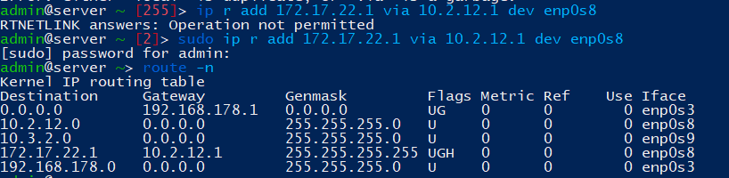

# Task 5.1

### Linux Networking

### *0. In order for packets to pass through our server to other subnets, you need to set the value net.ipv4.ip_forward=1.

> sudo sysctl -w net.ipv4.ip_forward=1

or

> sudo echo 1 > /proc/sys/net/ipv4/ip_forward

Using either method above will not make the change persistent. To make sure the new setting survives a reboot, you need to edit the /etc/sysctl.conf file.

### 1. Configured interfaces on server, created networks 10.2.12.0/24, 10.3.2.0/24, 172.16.12.0/24.

File: ubuntu - /etc/netplan/*.yaml, centos7 - /etc/sysconfig/network-scripts/ifcfg-(name intarfaces)

### 2. DHCP.

#### Installed Dhcpd.

> apt-get install isc-dhcp-server -y 

> sudo systemctl start isc-dhcp-server.service

> sudo systemctl enable isc-dhcp-server.service

Open /etc/dhcp/dhcpd.conf and write.

> systemctl restart isc-dhcp-server.service

Client1:

Client2:

### 3. Ping.

> ping: 10.2.12.2 to 10.3.2.2

>ping 10.2.12.2 to internet(google.com)

No connected to internet, because the packets reach the destination, but the router does not know where to send the response.

#### Added static routes on router.

Сheck traceroute

> traceroute 10.2.12.2 to .8.8.8.8

### 4. Add static IP on loopback intarfaces.

Created routing client2 to client1.

Sever:

> sudo ip r add 172.17.22.1 via 10.2.12.1 dev enp0s8

client2:

in server

> sudo ip r add 172.17.22.1 via 10.3.2.1 dev enp0s3

in net4

> sudo route add -host 172.17.32.1 gw 172.16.12.2

> traceroute:

### 5. Summarizing IP.

in server:

> sudo route add -net 172.17.0.0 netmask 255.255.192.0 gw 10.2.12.1 dev enp0s8

in client2:

> sudo route add -net 172.17.0.0 netmask 255.255.192.0 gw 10.3.2.1 dev enp0s3

### 6. Openssh. ssh-keygen, ssh-copy-id.

Server:

Client2:

Client3:

### 7. Iptables.

ACCEPT:

> iptables -A INPUT -s 10.3.2.0/24 -p tcp --dport 22 -j DROP

DROP:

> iptables -A INPUT -s 10.2.12.0/24 -p tcp --dport 22 -j ACCEPT

> iptables -A FORWARD -s 10.3.2.2 -d 172.17.32.1 -p icmp -j DROP

> iptables -A FORWARD -s 10.3.2.2 -d 172.17.22.1 -p icmp -j DROP

### 8. NAT

> iptables -A POSTROUTING -t nat -s 10.3.2.0/24 -o enp0s3 -j MASQUERADE

> iptables -A POSTROUTING -t nat -s 10.2.12.0/24 -o enp0s3 -j MASQUERADE

OR

> iptables -A POSTROUTING -t nat -s 10.3.2.0/24 -o enp0s3 -j SNAT --to-source 192.168.178.75

> iptables -A POSTROUTING -t nat -s 10.3.12.0/24 -o enp0s3 -j SNAT --to-source 192.168.178.75

