# Task 4 Azure Cloud.

## Part 1 - Configure application.

### 1. Created a service connection in Azure DevOps.

Step 1. created azure subscription.
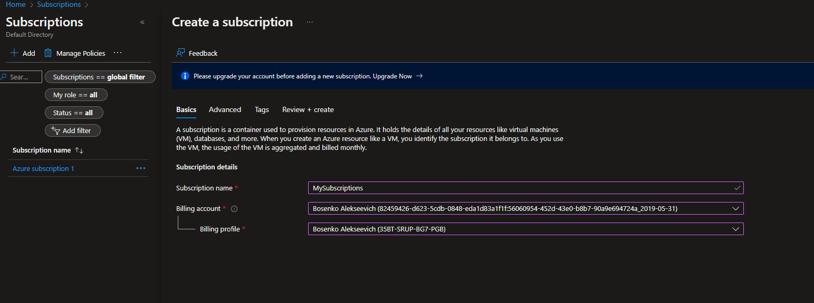

Step 2. created Azure DevOps organization.
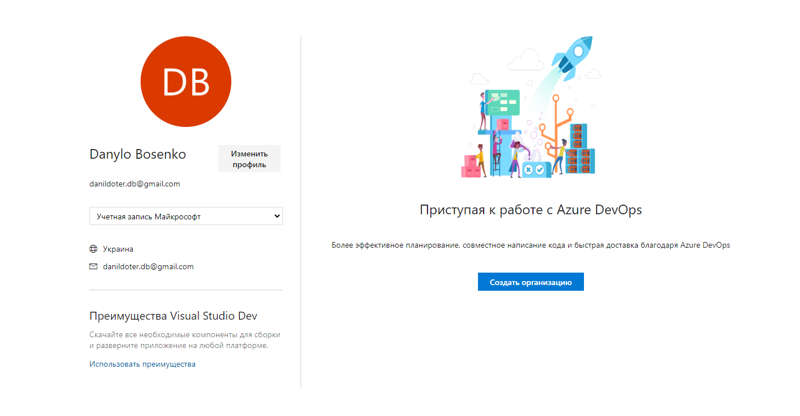

Step 3.  created project in Azure DevOps organization.
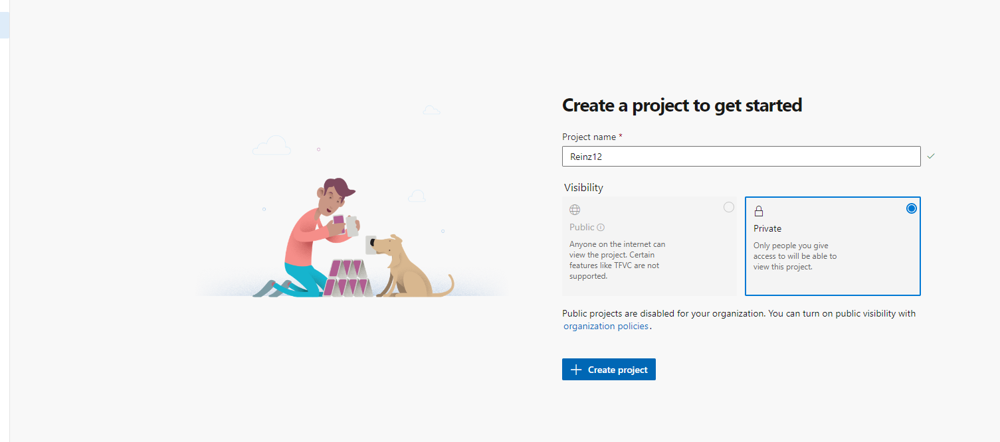

Step 4. Connected Azure DevOps project to my subscription.
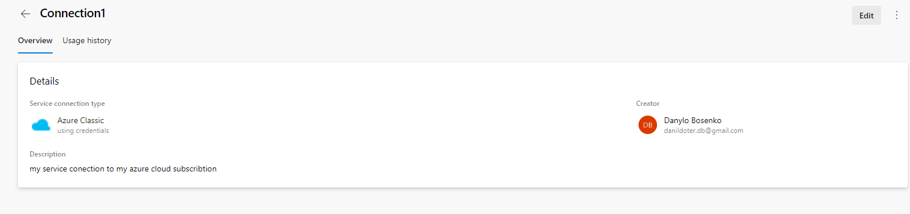

### 2-3. Created a .net pet project for the experiments and built the locally.
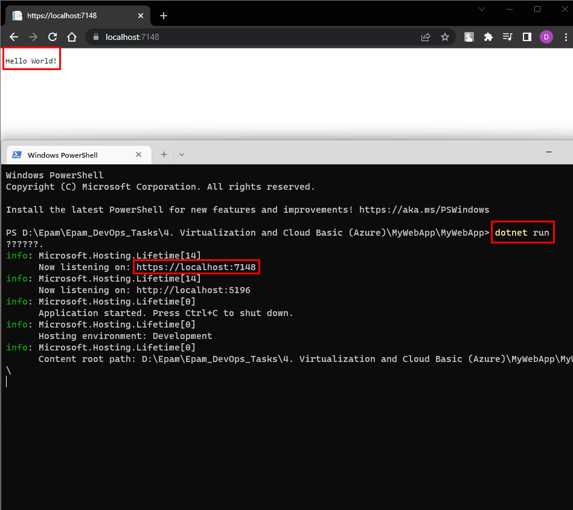

> dotnet run

### 4. Created repo an Azure DevOps.

Step 1. Created Repo.
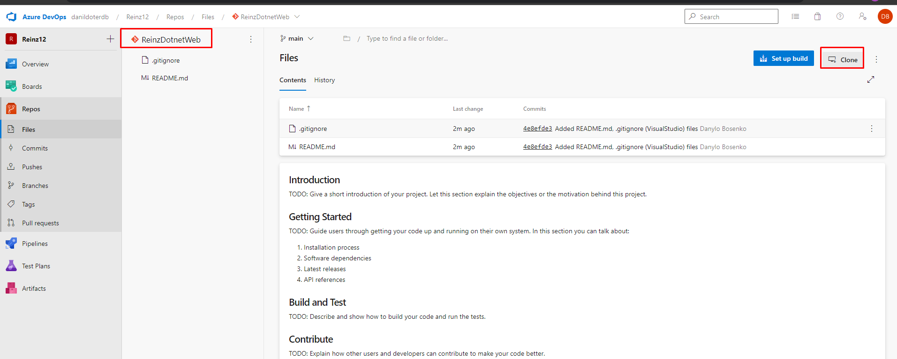

Step 2. Cloned the repository to my local machine.

>git clone https://danildoterdb@dev.azure.com/danildoterdb/Reinz12/_git/ReinzDotnetWeb

Step 3. Moved MyWebAppDotnet to the git repo.

>cd .\ReinzDotnetWeb\

>mv MyWebApp/* ReinzDotnetWeb/

Step 4. Added new files to git. Commited and push to Azure DevOps.

>git add .

>git commit -a -m "My first commit"

>git push

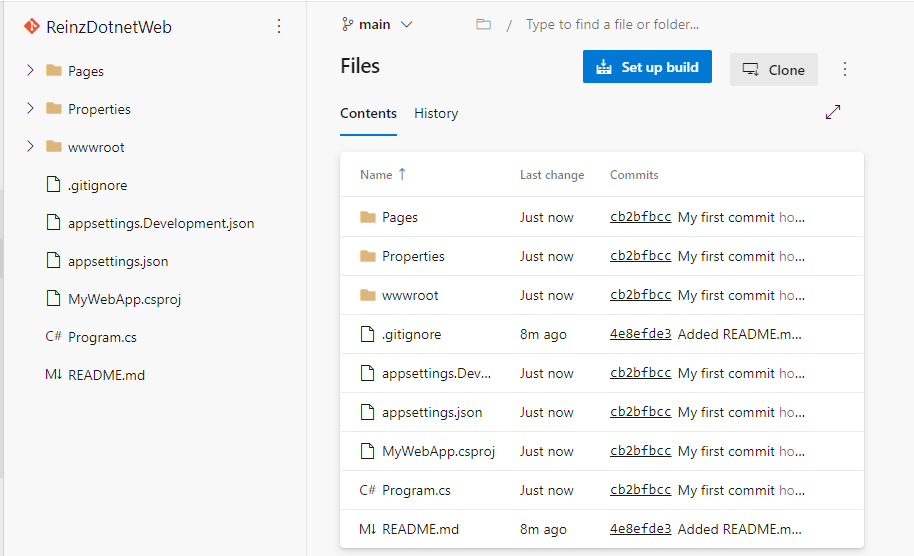

### 5. Create a branching policy for my app. Added myself as a reviewer.

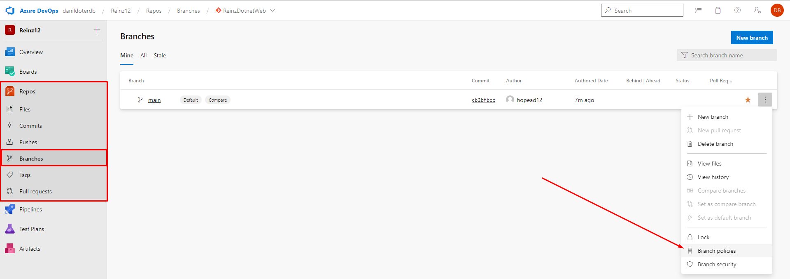

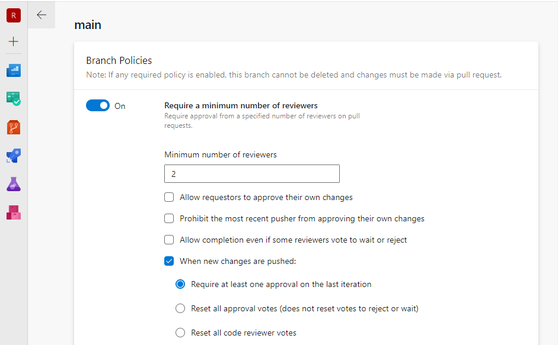

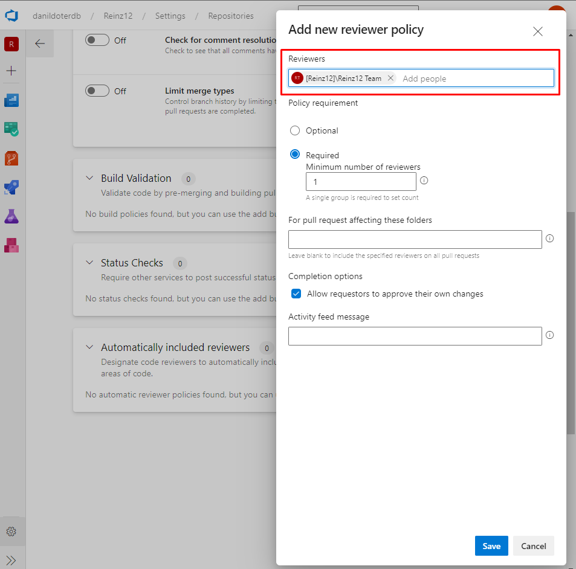

## Part 2. Configured a pipeline to deploy infrastructure.

The first install Azure Cli for use Terraform.

>wget https://azcliprod.blob.core.windows.net/msi/azure-cli-<version>.msi

Tried to run.

>az

Ran the following command.

>Invoke-WebRequest -Uri https://aka.ms/installazurecliwindows -OutFile .\AzureCLI.msi; Start-Process msiexec.exe -Wait -ArgumentList '/I AzureCLI.msi /quiet'; rm .\AzureCLI.msi

Logged to Azure.

>az login

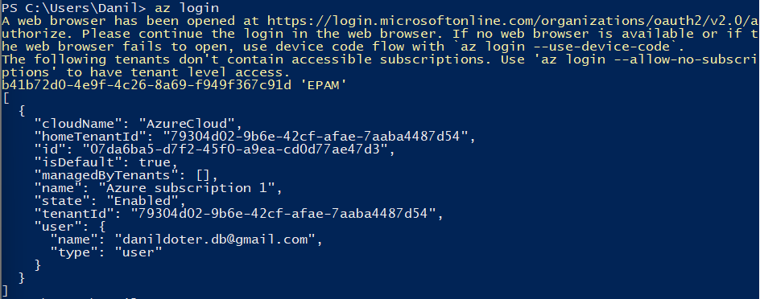

Set my subscription.

>az account set --subscription "07da6ba5-d7f2-45f0-a9ea-cd0d77ae47d3"

Created a Service Principal and got credentials.

>az ad sp create-for-rbac --role="Contributor" --scopes="/subscriptions/07da6ba5-d7f2-45f0-a9ea-cd0d77ae47d3"

Added credentials to my enviroment variables.

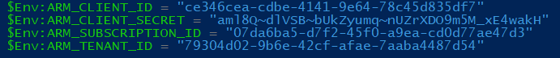


Created terraform main.tf.

Tried to run it
```
terraform {
  required_providers {
    azurerm = {
      source  = "hashicorp/azurerm"
      version = "~> 3.0.2"
    }
  }

  required_version = ">= 1.1.0"
}

provider "azurerm" {
  features {}
}

resource "azurerm_resource_group" "rg" {
  name     = "myTFResourceGroup"
  location = "westus2"
}
```
> terraform init

> terraform plan

> terraform apply 

## Terraform storage account.  

### 1. Created a separate storage-resource-group.

>az group create --name storage-resource-group --location eastus

>az account list-locations --query "[].{Region:name}" --out table
 
>az storage account create --name reinz1203storage --resource-group storage-resource-group --location eastus --sku Standard_RAGRS --kind StorageV2   

### 2. Created a container.    

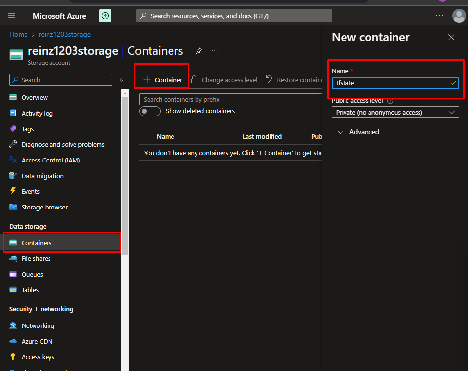


## Terraform preparation.

### 1. Created another repo to store devops code. 

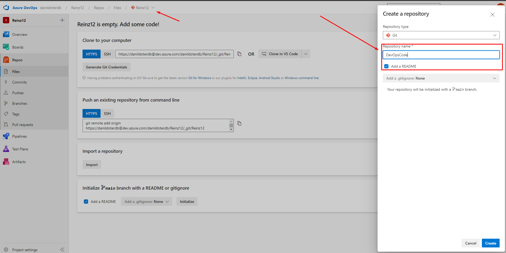

### 2. Created a folder terraform.

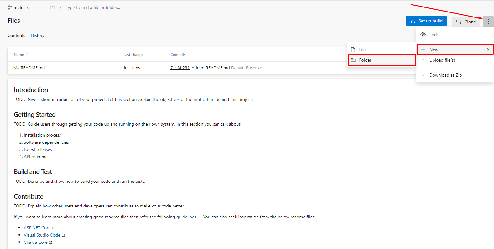

>git clone https://danildoterdb@dev.azure.com/danildoterdb/Reinz12/_git/DevOpsCode

### 3. Added app service implementation.

Created main.tf and added the following code.

```
terraform {
  required_providers {
    azurerm = {
      source  = "hashicorp/azurerm"
      version = "~> 3.0.0"
    }
  }
  required_version = ">= 0.14.9"
}

provider "azurerm" {
  features {}
}

# Generate a random integer to create a globally unique name
resource "random_integer" "ri" {
  min = 10000
  max = 99999
}

# Create the resource group
resource "azurerm_resource_group" "rg" {
  name     = "myResourceGroup-${random_integer.ri.result}"
  location = "eastus"
}

# Create the Linux App Service Plan
resource "azurerm_service_plan" "appserviceplan" {
  name                = "webapp-asp-${random_integer.ri.result}"
  location            = azurerm_resource_group.rg.location
  resource_group_name = azurerm_resource_group.rg.name
  os_type             = "Linux"
  sku_name            = "B1"
}

# Create the web app, pass in the App Service Plan ID
resource "azurerm_linux_web_app" "webapp" {
  name                  = "webapp-${random_integer.ri.result}"
  location              = azurerm_resource_group.rg.location
  resource_group_name   = azurerm_resource_group.rg.name
  service_plan_id       = azurerm_service_plan.appserviceplan.id
  https_only            = true
  site_config { 
    minimum_tls_version = "1.2"
    application_stack {
      node_version = "16-lts"
    }
  }  
}

#  Deploy code from a public GitHub repo
resource "azurerm_app_service_source_control" "sourcecontrol" {
  app_id             = azurerm_linux_web_app.webapp.id
  repo_url           = "https://github.com/Azure-Samples/nodejs-docs-hello-world.git"
  branch             = "main"
  use_manual_integration = true
  use_mercurial      = false
}
```
### 4. Integrated application insights with app service.

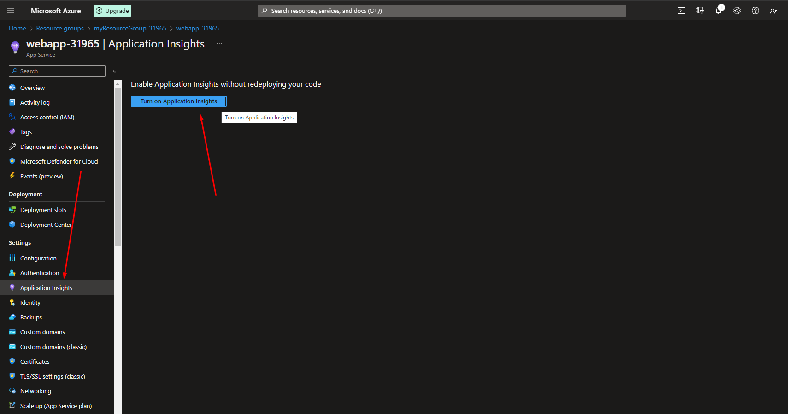

### 5. Configured terraform backend state. 

```
backend "azurerm" {
        resource_group_name  = "storage-resource-group"
        storage_account_name = "reinz1203storage"
        container_name       = "tfstate"
        key                  = "terraform.tfstate"
}
```
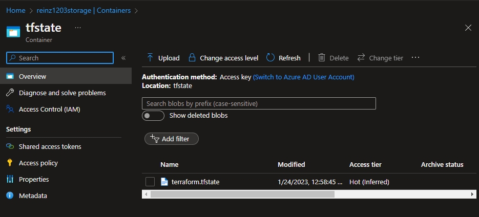

### 6. Logged to Azure Cli.

> az login

### 7. Ran Terraform.

>terraform init

>terraform plan

>terraform apply

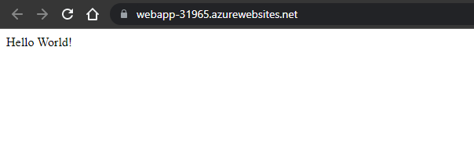

## Created a terraform pipeline.

```
# Starter pipeline

# Start with a minimal pipeline that you can customize to build and deploy your code.
# Add steps that build, run tests, deploy, and more:
# https://aka.ms/yaml

trigger:
- main


pool:
  name: default

stages:
 - stage: tfvalidate
   jobs:
    - job: validate
      continueOnError: false
      steps: 
       - task: TerraformInstaller@0
         inputs:
           terraformVersion: 'latest'
       - task: TerraformTaskV3@3
         inputs:
           provider: 'azurerm'
           command: 'init'
           workingDirectory: '$(System.DefaultWorkingDirectory)/terraform/'
           backendServiceArm: 'Azure subscription 1(07da6ba5-d7f2-45f0-a9ea-cd0d77ae47d3)'
           backendAzureRmResourceGroupName: 'storage-resource-group'
           backendAzureRmStorageAccountName: 'reinz1203storage'
           backendAzureRmContainerName: 'tfstate'
           backendAzureRmKey: 'terraform.tfstate'
       - bash:
           ls -l
       - task: TerraformTaskV3@3
         inputs:
           provider: 'azurerm'
           command: 'plan'
           workingDirectory: '$(System.DefaultWorkingDirectory)/terraform/'
           environmentServiceNameAzureRM: 'Azure subscription 1(07da6ba5-d7f2-45f0-a9ea-cd0d77ae47d3)'
       - task: TerraformTaskV3@3
         inputs:
           provider: 'azurerm'
           command: 'apply'
           workingDirectory: '$(System.DefaultWorkingDirectory)/terraform/'
           environmentServiceNameAzureRM: 'Azure subscription 1(07da6ba5-d7f2-45f0-a9ea-cd0d77ae47d3)'
```

## Part 3 – Create a deploy pipeline to app service.
```
# Starter pipeline
# Start with a minimal pipeline that you can customize to build and deploy your code.
# Add steps that build, run tests, deploy, and more:
# https://aka.ms/yaml

trigger:
- main

pool:
  name: default

stages:
  - stage: build
    jobs: 
     - job: dotnetbuild
       continueOnError: false
       steps:
       - script: 'ls -l'
         displayName: 'Check currently workdir'
       - script: 'ls $(System.DefaultWorkingDirectory)' 
       - task: DotNetCoreCLI@2
         inputs:
          command: 'build'
          projects: '.'
       - task: ArchiveFiles@2
         inputs:
            rootFolderOrFile: '$(Build.BinariesDirectory)'
            includeRootFolder: true
            archiveType: 'tar'
            archiveFile: '$(Build.ArtifactStagingDirectory)/$(Build.BuildId).zip'
            replaceExistingArchive: true

       - task: PublishPipelineArtifact@1
         inputs:
          targetPath: $(System.DefaultWorkingDirectory)
          artifactName: WebApp
  - stage: artifact
    jobs: 
     - job: download
       continueOnError: false
       steps:
       - task: DownloadBuildArtifacts@1
         inputs:
           buildType: 'current'
           downloadType: 'single'
       - script: 'pwd'
       - task: AzureRmWebAppDeployment@4
         inputs:
           ConnectionType: 'AzureRM'
           azureSubscription: 'Azure subscription 1(07da6ba5-d7f2-45f0-a9ea-cd0d77ae47d3)'
           appType: 'webAppLinux'
           WebAppName: 'WevappDotnet-1203'
           packageForLinux: '$(System.DefaultWorkingDirectory)'
           RuntimeStack: 'DOTNETCORE|6.0'
           StartupCommand: 'dotnet run'
       - script: 'ls $(System.DefaultWorkingDirectory)'
```
