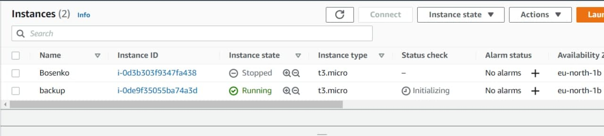

# Task 5 AWS

#### Step 1

I created account on AWS and comleted labs on tutorials.


#### Step 2

###### AWS EC2

Launch my instance.

```
AMI - Amazon Linux 2
Instance Type - t3.micro
Network - default
Storage size - 8 GB (SSD)
Security Group - only SSH
```
And connected to it with MobaXterm.


#### Step 3

Created a snapshot of my instance and AMI for backup.


#### Step 4 

Created and attached a Disk_D to my instace.


#### Step 5

Launch backup.



Attached a Disk_D to backup.


#### Step 6

Created instance with WordPress on LightSail and ran my domain on *pp.ua.


#### Step 7

###### S3 Bucket

Created repository on S3 Bucket, uploaded some files.


#### Step 8

Created new user AWS - Administator.
Used CLI AWS and login in AWS.
Created new bucket "my-second2-buckup-bucket"
Uploaded file with CLI.

>aws s3 cp "C:\Users\Danil\Bosenko\Vagrantfile" s3://my-second2-backup-bucket


#### Step 9
###### AWS ECS

Installed Docker on an Amazon EC2 instance

>sudo yum install docker

Started to the Docker service. Add to group docker and reboot.
```
sudo service docker start
sudo usermod -a -G docker ec2-user
sudo reboot
```
Created docker file. Built and ran.
```
touch Dockerfile
vim Dockerfile
docker build -t hello-world .
docker run -t -i -p 80:80 hello-world
```


#### Step 10

Created cluster.


#### Step 11
###### Lambda


#### Step 12
###### Static website

http://website-danylo-bosenko.s3-website.eu-central-1.amazonaws.com/